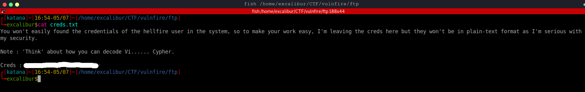

# Vulnfire 
This is a writeup for a CTF machine leveled as easy created by @hellfire and @xploit.
Download link - [Google Drive Link](https://drive.google.com/file/d/1U6tLn-VgHD4dcU2sAhCL5V1mKykympKm/view?usp=sharing "https://drive.google.com/file/d/1U6tLn-VgHD4dcU2sAhCL5V1mKykympKm/view?usp=sharing")
Note from creators - 

**NOTE : The mentioned CTF is uploaded in google drive with a name of the file, VULNFIRE.ova. Download the file and start the hunt. It might be best if you use VirtualBox because it works fine on it rather than VMWare.**

Install the machine by importing the .ova file in virtualbox and setting up Networking part as you would do with VulnHub machines.
Find the IP address by scanning the network interface using CIDR notation with nmap.
For example, Since i set up machines on an Internal network to communicate on, i took my attacker machine's ip and scanned `IP_address/24`

---
## Recon
Let's start by enumerating the ip address and finding open ports and services exposed.
Using nmap with deafult script tag and version enumeration to find open ports on the target 
```
Nmap 7.92 scan initiated Mon Jul  4 15:13:03 2022 as: nmap -sC -sV -vv -oN nmap.txt 10.10.10.2
Nmap scan report for 10.10.10.2
Host is up, received syn-ack (0.0033s latency).
Scanned at 2022-07-04 15:13:03 +05 for 42s
Not shown: 996 filtered tcp ports (no-response)
PORT   STATE  SERVICE  REASON       VERSION
20/tcp closed ftp-data conn-refused
21/tcp open   ftp      syn-ack      vsftpd 3.0.3
| ftp-anon: Anonymous FTP login allowed (FTP code 230)
|_Can't get directory listing: TIMEOUT
| ftp-syst: 
|   STAT: 
| FTP server status:
|      Connected to ::ffff:10.10.10.3
|      Logged in as ftp
|      TYPE: ASCII
|      No session bandwidth limit
|      Session timeout in seconds is 300
|      Control connection is plain text
|      Data connections will be plain text
|      At session startup, client count was 3
|      vsFTPd 3.0.3 - secure, fast, stable
|_End of status
22/tcp open   ssh      syn-ack      OpenSSH 8.2p1 Ubuntu 4ubuntu0.3 (Ubuntu Linux; protocol 2.0)
| ssh-hostkey: 
|   3072 5a:a7:bb:e0:71:4d:a6:de:b1:4a:33:99:08:64:8c:e1 (RSA)
| ssh-rsa AAAAB3NzaC1yc2EAAAADAQABAAABgQDYmcbIoWceZJx34jGvukqBS3Gr8UxJjGhEhB+Q9c/gAp6bf5H57tbw9oWCY+GExTTjgMJhbL8ExK+oYpybkwdfNNBz6MZtMpY/xfNpNWe8i4z0gOHJ8fEJ2R5Xe06lFjfEhXivoSib/hKE7N2LS3CzAnUsBaKc03p7VitHVtXljsHFaIXhZ2LWOgINMw6MuI7DbZ0faaE7/hZ6DSF3+uLh/Y3DBrBFJXVFuS8jh0wmj/1zNV+ws6550rk8ipUpEoIFS5QKZ7MmfpkRrDEMVDV5tIGRuWqAgVoT8C4UMNBHgSlFXAlfLOd4+nkfBg6KmB5ZoVtezIpmehomWbiAfUvCt4h4SX3RqVEFNnpmasOGRj2jtAfbzU0o+LukdhsxlmovSreGZ6KvX3LnC1kxsCBjeq0TetIi4gIm0xj9KLNtPzA5hCb9CtkzD8YpHFPWh1ZkCDm6fPIOlxOrPS7OwRBh1UiXsrC3dzkDqPZLW5mq0Lqr7bfZg4/k2JpQ7ZiJ49k=
|   256 1d:01:1f:df:79:84:47:f3:20:fb:72:c3:d6:20:71:03 (ECDSA)
| ecdsa-sha2-nistp256 AAAAE2VjZHNhLXNoYTItbmlzdHAyNTYAAAAIbmlzdHAyNTYAAABBBO6A0y/3ftcML11jU+hGgTQXGCNG+QkhMUifnGnlgcMMHkU+qOJrisLvfxW9o978/qzwEyEhsPbMWHbRmT0j2G8=
|   256 ef:10:bb:ea:d7:44:88:5b:ef:57:03:8c:45:20:1a:8e (ED25519)
|_ssh-ed25519 AAAAC3NzaC1lZDI1NTE5AAAAIAkzcehwqJhTcPbmAVLt9YUMN/1qREuPFroeEuNHbnbr
80/tcp open   http     syn-ack      Apache httpd 2.4.41 ((Ubuntu))
|_http-server-header: Apache/2.4.41 (Ubuntu)
| http-methods: 
|_  Supported Methods: POST OPTIONS HEAD GET
|_http-title: Apache2 Ubuntu Default Page: It works
Service Info: OSs: Unix, Linux; CPE: cpe:/o:linux:linux_kernel

Read data files from: /usr/bin/../share/nmap
Service detection performed. Please report any incorrect results at https://nmap.org/submit/ .
Nmap done at Mon Jul  4 15:13:45 2022 -- 1 IP address (1 host up) scanned in 42.52 seconds
```

According to the scan , there are 3 ports open. I only scanned 1000 ports in this case but a full port scan is always beneficial.
Let's enumerate these services one by one.

### Enumerating Anonymous FTP
By going through nmap results, it tells us there is an anonymous login enabled on the ftp server. Provide the username as Anonymous and leave password empty.
You will get into the server. There are two interesting files there.


I got those two files on my machine using `get filename`.

Contents of note.txt 


It gives 3 hints:
- webserver has a file which contain some kind of key
- there are php files on the webserver
- an image have steganographic data in them

Unzipping confidential.zip
It gives two files , fire.jpg and secret.txt 


This image may contain steganographic data.
Tried different steg tools but couldn't find something for now.
Maybe we need a key to extract the data

Checking the other file


It tells us that the webserver shows default ubuntu page as nothing is configured for it. It also points that we have to perform fuzzing with certain file extension to find files existing on webserver.

### Enumerating HTTP
Visited the http server and found default page as stated above.
I tried opening robots.txt, viewing source code and other manual enumeration steps, nothing of interest found. 
Since we don't have any other data to look at and also the hint pointed, we fuzz for files and directories.
Used Gobuster with extension `.php` as mentioned in ftp file.


found a file which have 200 response code.
It redirects to op_security.php?cmd= 
Since the file had a parameter , i tried injecting commands & checked for LFI using different payload cases.
After wasting around 5-10 mins, checked source code and found list of all parameters present(Check source code in starting, might save some time for you. Don't be a noob like me :) )


copied them into a txt file.
used ffuf for fuzzing the parameter with `id` value(could be any command which gives results)
`ffuf -c -u 'http://$ip/op_security.php?FUZZ=id' -w dic.txt`


All the parameters have same output but one stands out as it have different number of output lines.
used that and tried command injection and it was successfull


read the file using cat


Since it talks about steganography , tried that password for extracting files from the image.

### Getting access to system
used steghide on fire.jpg with above password
it extracted creds.txt



It have the credentials for user but is encoded. The note tells us about decoding it as 'Vignere cipher' as it says 'Vi.. Cypher' . Also, it have provided the key to the cipher by highlighting the word **Think** with quotes.
using 'Think' as key and decoding string using online sites.
found creds for the user for ssh

### Lateral Privesc
found user.txt and a message.txt


Quickly searched for user on twitter cause that's the most used osint social media account. Maybe would have used sherlock if haven't found it.
Found a paste-bin for leaked credentials , maybe there is password for another user that is on the machine i.e xploit.

copied hashes in a file and used john to crack them all
`john hashes.txt --wordlist=/usr/share/wordlists/rockyou.txt --format=RAW-SHA256`
`john hashes.txt --format=RAW-SHA256 --show`
found 171 passwords , saved in a passwords.txt file

used hydra to bruteforce ssh pass for xploit


### Privesc to root
Login as xploit using above creds.
found evil.txt which says:
`#TryHarder! Root password is unusual among many...`
It suggested that there is a password leak somewhere and it contains many passwords , one of them is root's and it is unusual (not common).

tried some manual recon and found interesting file in /var/backups/.bak (Thanks to IppSec for this)
used `tar -xvf secret.tar`
After extracting , it gave out 4 pcap files.
I transferred them to my machine using scp.
Since they are pcaps, thought of using wireshark but basic forensics comes first.
Ran strings on first , nothing seems unusual.
Ran strings on second, found it contains ftp login packet capture ( as ftp is in plaintext)


there are passwords supplied too.
found different passwords for root
grep for lines which contains passwords only.
one password stands out and hint pointed the root's password to be unusual among many.


### Getting the root flag
`su root` with this password and now we are root
found confidential.txt which says to read about.me file


about.me is encoded 


Looks like simple base64 
base64 decode it and found the flag.

